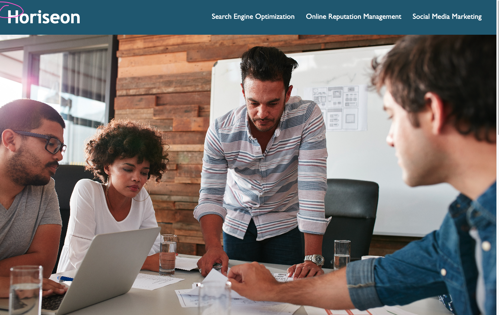

# week-1-code-refactor-challenge

Code Refactor For Horiseon Webpage.

 # <Horiseon Social Solutions Services>

## User Story

```
AS A marketing agency
I WANT a codebase that follows accessibility standards
SO THAT our own site is optimized for search engines
```

## Acceptance Criteria

```
GIVEN a webpage meets accessibility standards
WHEN I view the source code
THEN I find semantic HTML elements
WHEN I view the structure of the HTML elements
THEN I find that the elements follow a logical structure independent of styling and positioning
WHEN I view the icon and image elements
THEN I find accessible alt attributes
WHEN I view the heading attributes
THEN they fall in sequential order
WHEN I view the title element
THEN I find a concise, descriptive title
```


## Description

This website was created for individuals that were seeking knowledge in regards to social media. It contains descriptions for search engine optimization, online repuation managment, social media marketing, cost managment, brand awareness and lead generation. I made changes in order to make the website more accessible for example used semantic HTML elements, adding accessbile alt attributes, adding a concise and descriptive title, made sure all links were functioning and notes in HTML/CSS.

## Deployed Page




## Installation

N/A

## Usage

To use this website, you can look at the description by either scrolling down or clicking on one of the three links at the top of the webpage, which will take you straight to that specific description.

## Contributions 

* Horiseon Webpage Created by UOB Bootcamp
* Code Refactoring Completed By Myra Khatoon

## Review

 * URL Of Deployed Application (https://myra-k.github.io/week-1-code-refactor-challenge/)

 * URL Of GitHub Repository (git@github.com:Myra-k/week-1-code-refactor-challenge.git)

## License

N/A